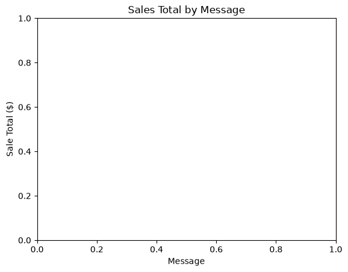

# streaming-06-scenarios

> Streaming data analytics: complete pipeline.

This project demonstrates a complete Kafka streaming workflow.

Sales records are produced to a Kafka topic, consumed and validated,
enriched with derived fields, stored in DuckDB, and analyzed using a
Jupyter notebook.

## Custom Project Overview

This project extends the streaming analytics example by adding a
custom derived field named `sowers_sales_level`.

The producer streams sales transactions to the Kafka topic:

```text
streaming-06-scenarios-sowers
```

The consumer validates messages, computes derived values, writes
records to CSV, stores data in DuckDB, and classifies transactions as
either `High` or `Standard`. I created a Jupyter notebook to analyze
the consumed data and visualize total revenue by region.

## Working Files

You'll work primarily with:

- **data/** - input and output files
- **docs/** - project documentation
- **Notebook/** - Jupyter notebook analysis
- **src/streaming/** - producer, consumer, and support modules
- **pyproject.toml**
- **zensical.toml**

## Instructions

Follow the
[⭐ **Workflow: Apply Example**](https://denisecase.github.io/pro-analytics-02/workflow-b-apply-example-project/)
to complete:

1. Phase 1. **Start & Run**
2. Phase 2. **Change Authorship**
3. Phase 3. **Read & Understand**
4. Phase 4. **Modify**
5. Phase 5. **Apply**

## Success

Use four named terminals:

1. **kafka**
2. **topics**
3. **producer**
4. **consumer**

After the producer and consumer run successfully, you should see:

```text
========================
Consumer executed successfully!
========================
```

A new `project.log` file will appear in the root project folder and
processed data will appear in `data/output/`.

## Command Reference

### Terminal 1: Start Kafka (`kafka`)

Open a new VS Code terminal and rename it `kafka`.

If running Windows, specify the terminal type as **wsl** or type:

```bash
wsl
```

Run the commands one at a time.

#### Step 1. Verify Java and PATH

```bash
echo "$JAVA_HOME"

"$JAVA_HOME/bin/java" --version
```

#### Step 2. Rebuild Cluster ID (as needed)

```bash
cd ~/kafka

rm -rf /tmp/kraft-combined-logs

KAFKA_CLUSTER_ID="$(bin/kafka-storage.sh random-uuid)"

echo "Cluster ID: $KAFKA_CLUSTER_ID"

bin/kafka-storage.sh format \
  --standalone \
  -t "$KAFKA_CLUSTER_ID" \
  -c config/server.properties
```

#### Step 3. Start Kafka Server

```bash
cd ~/kafka

bin/kafka-server-start.sh config/server.properties
```

Keep this terminal running.

### Terminal 2: Create Topic (`topics`)

Open another VS Code terminal and rename it `topics`.

If running Windows, specify the terminal type as **wsl** or type:

```bash
wsl
```

Run:

```bash
cd ~/kafka

bin/kafka-topics.sh --create \
  --bootstrap-server localhost:9092 \
  --partitions 1 \
  --replication-factor 1 \
  --topic streaming-06-scenarios-sowers
```

### Terminal 3: Run the Producer (`producer`)

Open another VS Code terminal and rename it `producer`.

If running Windows, use **PowerShell**.

Run:

```shell
uv sync --extra dev --extra docs

uv run python -m streaming.kafka_producer_sowers
```

### Terminal 4: Run the Consumer (`consumer`)

Open another VS Code terminal and rename it `consumer`.

If running Windows, use **PowerShell**.

Run:

```shell
uv run python -m streaming.kafka_consumer_sowers
```

## Troubleshooting

If your Kafka installation uses KRaft mode instead of the course
legacy setup, replace `config/server.properties` with
`config/kraft/server.properties` in the Kafka format and start
commands.

If Kafka fails to start, rebuild the cluster ID using the course
instructions.

If you accidentally enter Python interactive mode and see:

```text
>>>
```

or

```text
...
```

press `Ctrl+C` (or `Ctrl+Z` then Enter on Windows).

## Make a Technical Modification

For my technical modification, I enhanced the Kafka consumer
by adding a new derived field named `sowers_sales_level`.

The consumer classifies transactions based on the total sale amount.

Sales with totals greater than or equal to 100 are labeled `High`,
while all remaining sales are labeled `Standard`.

```python
enriched["sowers_sales_level"] = (
    "High" if enriched["total"] >= 100 else "Standard"
)
```

I also updated the output field list so the new column would be
written to:

```text
data/output/consumed_sales_sowers.csv
```

### Results

After running the producer and consumer, the output file successfully
included the new `sowers_sales_level` column.

Transactions with totals greater than or equal to 100 were categorized
as `High`, while all other transactions were categorized as
`Standard`.

This modification demonstrates how streaming data can be enriched with
additional business information before being stored and analyzed.

## Apply the Skills to a New Problem

I applied the streaming analytics workflow to a new problem by creating a
Jupyter notebook that transforms the consumed sales data into business insights.
Using pandas and matplotlib, I summarized and visualized total revenue by region.
This additional analysis extended the original streaming example beyond message
production and consumption and demonstrated how streaming data can support
decision-making.

### Notebook Analysis

I used pandas and matplotlib to summarize the data stored in:

```text
data/output/consumed_sales_sowers.csv
```

The notebook generates visualizations that compare revenue across
regions.

### Business Insight

The notebook revealed that the US-TX region generated the highest
total revenue in the sample dataset.

This project demonstrated how streaming data can be transformed into
useful business intelligence through analysis and visualization.

## Visualization

The chart below summarizes total revenue by region using the consumed
Kafka sales data.



*Figure 1. Total revenue by region based on consumed sales data.*

- Explore the notebook:

```text
Notebook/sowers_sales_analysis.ipynb
```

for additional analysis and insights.
