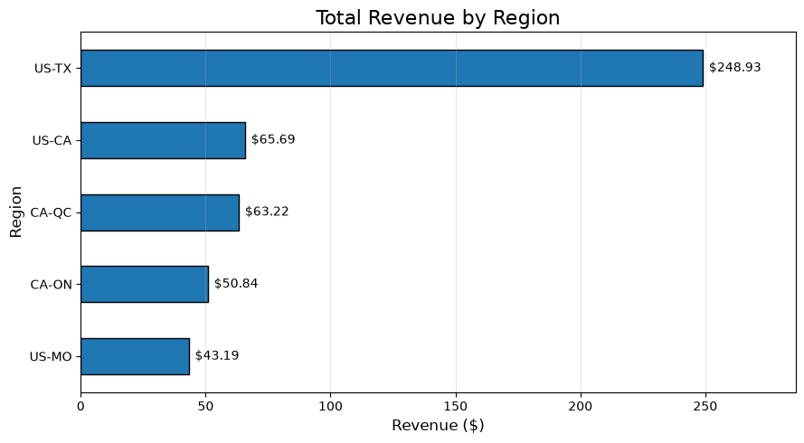

# Project Documentation Pages (docs/)

## Custom Project

### Dataset

My Kafka producer streams records from `sales_sowers.csv`.

The dataset contains sales transaction records. Each record includes
fields such as `order_id`, `datetime`, `region_id`,
`currency_code`, `product_id`, `unit_price`, `quantity`,
`is_online`, `customer_id`, and `payment_method`.

I used a copied version of the original sales dataset and renamed the
files with the `_sowers` suffix.

### Kafka Messages

The producer sends individual sales records through Kafka.

I used the topic:

```text
streaming-06-scenarios-sowers
```

The message key is the `region_id`, which groups records by sales
region.

I did not change the fields sent by the producer. Instead, I added
my custom field during consumer processing.

### Consumer Processing

The consumer receives sales messages from Kafka and validates each
record.

It calculates the following fields:

- `subtotal`
- `tax_amount`
- `total`
- `sowers_sales_level`

The consumer writes processed records to:

```text
data/output/consumed_sales_sowers.csv
```

and stores processed data in DuckDB.

My custom field labels sales with totals greater than or equal to
100 as `High`. All other sales are labeled `Standard`.

### Experiments

For my Phase 4 modification, I added a new derived field called
`sowers_sales_level`.

Transactions with totals greater than or equal to 100 are classified
as `High`. Remaining sales are classified as `Standard`.

```python
enriched["sowers_sales_level"] = (
    "High" if enriched["total"] >= 100 else "Standard"
)
```

For Phase 5, I created a Jupyter notebook to analyze the consumed
sales data. I used pandas and matplotlib to summarize the output and
visualize total revenue by region.

The notebook loads:

```text
data/output/consumed_sales_sowers.csv
```

and generates visualizations to summarize the results.

### Results

The producer and consumer executed successfully.

The output CSV included the new `sowers_sales_level` column.

The notebook revealed that the US-TX region produced the highest
revenue in the sample dataset, generating significantly more revenue
than the other regions.



*Figure 1. Total revenue by region based on consumed sales data.*

### Interpretation

This project helped me understand how messages move through a Kafka
streaming pipeline.

Compared to the original example, my project adds another layer of
business information by classifying sales as either `High` or
`Standard`.

Watching the producer and consumer run helped me better understand
how Kafka separates message production from message consumption.

Creating the notebook showed me how streaming data can be transformed
into business intelligence. The regional revenue analysis made it
easy to identify which regions generated the highest sales and
demonstrated how consumed messages can support business
decision-making.
